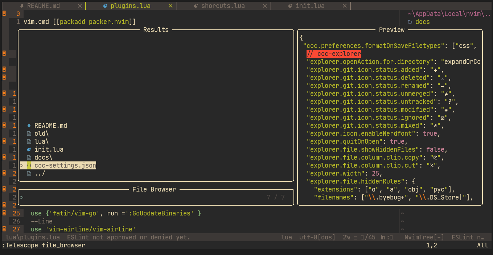
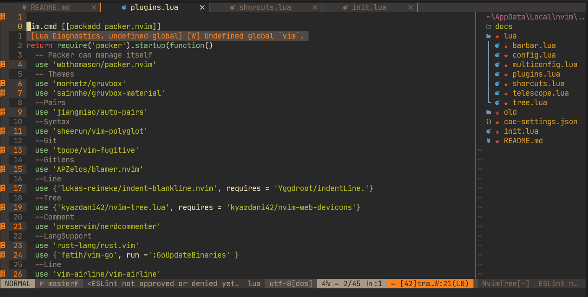

# My New Neovim Configuration

This is a better configurations that created in lua

For look the old config [here](https://github.com/TeoDev1611/NeoVim-Config)

## Screenshots

## Instalation

Clone my repository and install the manager called [packer](https://github.com/wbthomason/packer.nvim)

**Spoiler:** A script for install in python with a library

## Thanks for read this and if you like an :star: 
