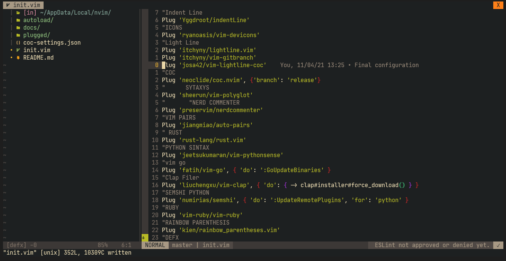
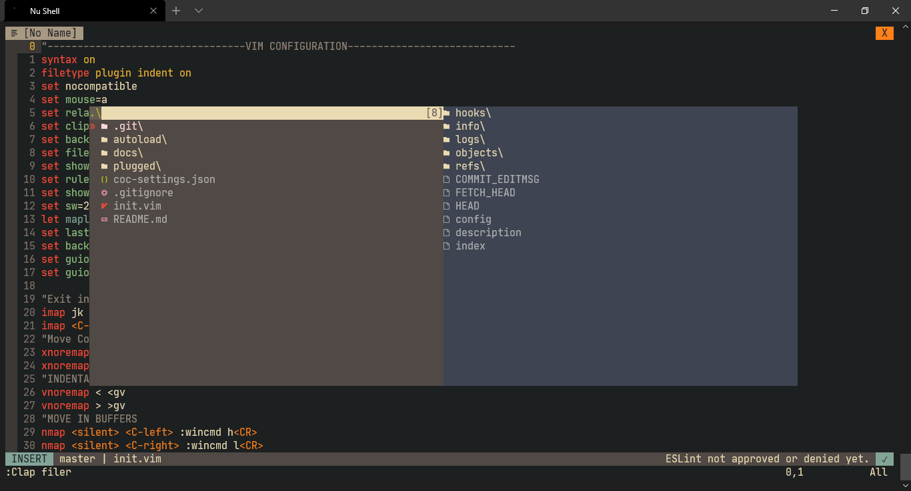

# My Portable Neovim Config


For install this configuration you need a NerdFont and Vim-Plug

## An example Screen Shot





## How install

> Install neovim after run that but if you are from windows and have installed
> **scoop** you can run **just win-install** but before install just 😃

1. Install just from [here](https://github.com/casey/just#installation)
2. Run

```
just --list
```

3. If you are from windows run

```
just win
```

4. If you are from linux run:

```
just linux
```

5. If you are from MacOs run:

```
just macos
```

#### Hi from Ecuador :thumbsup: :star:
